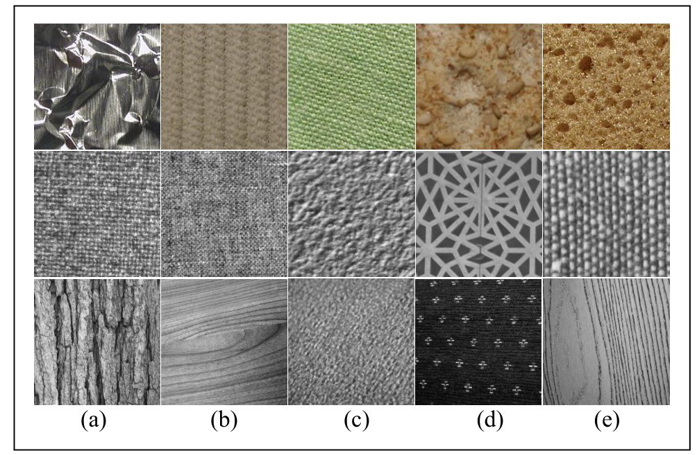

# Textures Classification dataset #

We integrate a dataset of surface texture (8674 images), which contains 64 classes from 3 public datasets.  The images are uniformly resized into  331 x 331. Notably, 11 classes (3194 images) from   KTH surface datast ( including KTH-TIPS and KTH-TIPS2)  , 28 classes (4480 without rotated patches) from  Kyberge  dataset, and 25 classes(1000 images) from the  UIUC dataset  dataset. Details are displayed in figure. 

These images are real-world surface texture from wood, blanket, cloth, leather, etc, it can be used to evaluate the capacity of the  models or used as a pretrain dataset to improve the performance of the CNN models for surface defect inspection.

The textures dataset. Each image is a sample of one texture class, first row is from the [KTH](http://www.nada.kth.se/cvap/databases/kth-tips), second row from [Kyberge](http://www.cb.uu.se/~gustaf/texture/), and third from [UIUC](http://www-cvr.ai.uiuc.edu/ponce_grp/data/).

the dataset is split  into half randomly, one for the
training set, and another for the validation. It is used in our upcoming paper "A compact convolutional neural network for surface defect inspection".

you can from [baiduyun](https://pan.baidu.com/s/1riU1BdYEFLNiXdQ3oOKUwg) Extraction code 513a 
 

-  

**If you have any difficult in access these datasets,** contact me by [huangyibin2014@ia.ac.cn](huangyibin2014@ia.ac.cn)

"# Textures-Dataset" 
